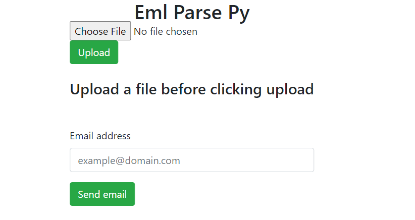
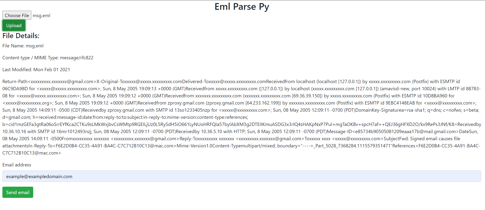

# Eml Parse Py 

 A web based SMTP analysis tool that parses mail into a HTML file; and is attached to an email for reporting purposes.
 
 



An example of the message headers being displayed:



The end user must have an email inserted into the email address before uploading the .eml file. 

## Tech stack in use:

- Python 3.8
- ReactJS 

# Installation:

- python -m pip install requirements.txt
- npm init Make sure you're here =>'frontend/'
- Node.JS installed on your computer.

#### FRONTEND 

```
Start the application:
npm start 
```

## To run Web application:
#### BACKEND: 

```

Populate ```SendEmailObjAttributes.json``` file under ```  backend\email_functionality``` omit the recipient field as user input is used, and I plan to use this field for something else in the future.
 
Create an environment variable 
Windows:
set / export  FLASK_APP=app.py <- This lets the below command "flask run" work.
set / export FLASK_ENV=development <- This sets the app to debug mode 

flask run

For reference:

export for *NIX systems/ MAC OS, and set for Windows
```


